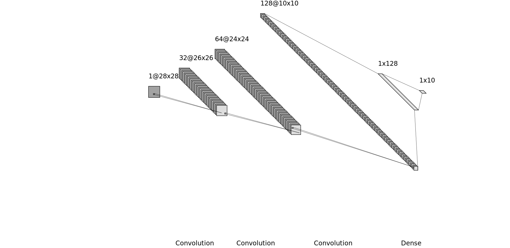

# digitRecognizer

Training set size 75200 images

| Training set  | Size  |
|---------------|-------|
| numbers-master| 15200 |
| mlxtend       | 60000 |

Number of parameters 1863562 parameters

| Layer         | Parameters |
|---------------|------------|
| Convolution 1 | 320 |
| Convolution 2 | 18496 |
| Convolution 3 | 204928 |
| Dense         | 1638528 |
| Output        | 1290 |
